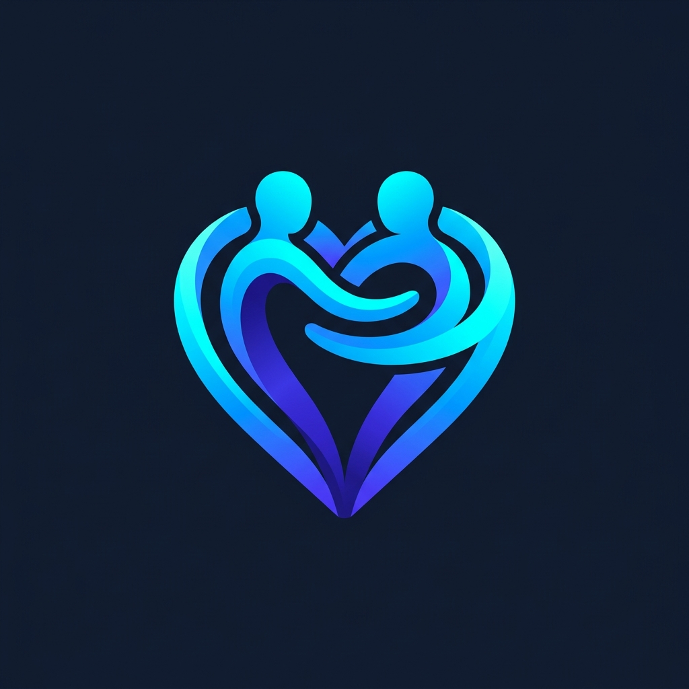

<p align="center">
  
</p>

<h1 align="center">Teman Sebayaku</h1>

<p align="center">
  <strong>Model Peer Counseling Berbantuan Digital Self-Help Bermuatan Nilai Kearifan Lokal untuk Meningkatkan Well-Being Remaja</strong>
</p>

<p align="center">
  
  
  
  
  
  
</p>

---

## 📌 Tentang Teman Sebayaku

**Teman Sebayaku** adalah platform kesehatan mental digital berbasis website yang didesain khusus sebagai media pendukung dalam pelaksanaan **Model Peer Counseling Berbantuan Digital Self-Help Bermuatan Nilai Kearifan Lokal**. Platform ini bertujuan untuk mendeteksi dini kesehatan mental dan membantu meningkatkan kondisi *well-being* (kesejahteraan psikologis) pada siswa tingkat SLTA/remaja melalui pendekatan terstruktur berbasis budaya.

Platform ini didukung oleh **LPPD-KEMENDIKTI SAINTEK** bekerjasama dengan tim kolaborasi lintas universitas dari:
* **Universitas Negeri Malang (UM)**
* **Universitas Negeri Yogyakarta (UNY)**
* **Universitas Negeri Padang (UNP)**

---

## 🚀 Fitur Utama

### 📊 1. Instrumen Well-Being Interaktif (Pre-Test & Post-Test)
* Pengisian kuesioner kesejahteraan psikologis yang responsif dengan penyimpanan jawaban otomatis (*auto-save*).
* Penyederhanaan pilihan jawaban tanpa menampilkan bias angka nilai skor langsung saat pengisian.
* Kalkulasi skor otomatis berbasis kriteria interpretasi nilai dari admin.
* Ekspor laporan hasil analisis kesejahteraan psikologis dalam format **PDF** yang rapi.

### 📚 2. Modul Budaya Digital Self-Help
* Pengelompokan materi bimbingan berdasarkan suku atau nilai kearifan lokal (misalnya budaya Jawa, Minang, dll).
* Memudahkan siswa menyerap nilai resiliensi dan kepribadian cerdas emosi melalui kearifan budaya yang dekat dengan keseharian mereka.

### ✍️ 3. Jurnal Refleksi Mandiri Berbasis WDEP
* Lembar kerja terstruktur yang didesain berdasarkan tahapan konseling realitas **WDEP (Want, Do/Doing, Evaluation, Planning)**:
  * **Want (W)**: Mengeksplorasi keinginan dan kebutuhan remaja.
  * **Do/Doing (D)**: Mengidentifikasi tindakan atau perilaku saat ini.
  * **Evaluation (E)**: Mengevaluasi kefektifan tindakan tersebut.
  * **Planning (P)**: Merumuskan rencana tindakan nyata yang bertanggung jawab.
* Sistem penyimpanan otomatis di setiap tahapan refleksi.

### 🤝 4. Alur Kolaborasi Konseling Sebaya (Peer Counseling)
* Konseli dapat memilih konselor sebaya (*peer counselor*) yang terdaftar di dalam sistem.
* Konselor sebaya dapat melacak progres pengerjaan instrumen dan modul *self-help* konseli, serta memberikan *feedback* bimbingan kognitif secara terarah.
* Sistem eskalasi rujukan ke Konselor Sekolah profesional jika dibutuhkan tindak lanjut sesi klinis.

### 👑 5. Panel Administrasi Komprehensif
* Manajemen data user (Admin, Konselor, Konseli).
* Pengaturan bank soal kuesioner instrumen *well-being*.
* Manajemen interpretasi rentang skor indeks kesejahteraan psikologis.
* Manajemen materi suku kearifan lokal dan modul bimbingan *self-help*.

---

## 🛠️ Arsitektur & Teknologi

* **Backend Framework**: Laravel 11.x (PHP 8.2+)
* **Database**: MySQL / MariaDB
* **Frontend Stack**: 
  * Blade Templating Engine
  * Tailwind CSS (melalui Vite Compiler)
  * Alpine.js (untuk reaktivitas frontend interaktif & auto-save)
* **Build System**: Vite 8.x
* **Export Engine**: Dompdf (untuk ekspor PDF laporan wellbeing)

---

## 📂 Struktur Direktori Utama

```
teman-sebayaku/
├── app/
│   ├── Http/
│   │   └── Controllers/     # Logic Controller (Auth, Admin, Konselor, Konseli)
│   └── Models/              # Representasi Database Eloquent ORM
├── database/
│   ├── migrations/          # Schema Migrations
│   └── seeders/             # Seeders data awal (soal instrumen, dll)
├── public/
│   ├── build/               # Aset Vite yang telah terkompilasi
│   └── image/               # Aset gambar, logo-mark, dan foto tim
├── resources/
│   ├── css/                 # Aset CSS & Integrasi Tailwind
│   ├── js/                  # JavaScript & Inisialisasi Alpine.js
│   └── views/               # Template Blade (layout dasar & dashboard per-role)
│       ├── admin/           # Tampilan Panel Administrator
│       ├── konseli/         # Tampilan Panel Siswa/Konseli
│       ├── konselor/        # Tampilan Panel Konselor Sebaya
│       └── layouts/         # Layout dasar platform (Base, Guest, Sidebar)
└── routes/
    └── web.php              # Definisi Routing sistem
```

---

## 🔧 Panduan Instalasi Lokal

Ikuti langkah-langkah di bawah untuk menjalankan proyek **Teman Sebayaku** di mesin lokal Anda:

### 1. Prasyarat
Pastikan Anda sudah menginstal:
* PHP >= 8.2
* Composer
* Node.js & NPM
* MySQL / MariaDB

### 2. Kloning Repositori
```bash
git clone https://github.com/username/teman-sebayaku.git
cd teman-sebayaku
```

### 3. Instalasi Dependensi PHP & JavaScript
```bash
composer install
npm install
```

### 4. Konfigurasi Lingkungan (.env)
Salin file `.env.example` menjadi `.env`:
```bash
cp .env.example .env
```
Buka file `.env` dan sesuaikan konfigurasi database Anda:
```env
DB_CONNECTION=mysql
DB_HOST=127.0.0.1
DB_PORT=3306
DB_DATABASE=teman_sebayaku
DB_USERNAME=root
DB_PASSWORD=
```

### 5. Generate Application Key & Link Storage
```bash
php artisan key:generate
php artisan storage:link
```

### 6. Jalankan Migrasi dan Database Seeder
Langkah ini akan membuat tabel database dan mengisinya dengan data awal (termasuk kuesioner, admin default, dll):
```bash
php artisan migrate --seed
```

### 7. Jalankan Server Pengembangan
Jalankan server Laravel (PHP) dan Vite secara bersamaan:
```bash
# Terminal 1: Menjalankan Laravel Development Server
php artisan serve

# Terminal 2: Menjalankan Vite Development Server
npm run dev
```
Akses platform melalui browser Anda di alamat: `http://127.0.5.1:8000` atau `http://localhost:8000`.

---

## 👥 Tim Pengembang

Platform ini dikembangkan oleh tim pakar ahli bimbingan konseling dan sains teknologi:

1. **Prof. Dr. M. Ramli, M.A** (FIP Universitas Negeri Malang)
2. **Prof. Dr. Budi Astuti, M.Si** (FIP Universitas Negeri Yogyakarta)
3. **Dr. Miftahul Fikri, M.Pd** (FIP Universitas Negeri Padang)
4. **Dr. Diniy Hidayatur Rahman, S.Pd., M.Pd** (FIP Universitas Negeri Malang)
5. **Nur Mega Aris Saputra, S.Pd., M.Pd** (FIP Universitas Negeri Malang)
6. **Nail Hidaya Afandi, S.Pd., M.Pd** (FIP Universitas Negeri Malang)
7. **Muh. Nur Alamsyah, S.Pd., M.Pd** (FIP Universitas Negeri Malang)

---

## 📄 Lisensi

Platform ini dirilis secara terbatas untuk kepentingan akademis, riset, dan pengabdian masyarakat di bawah naungan **LPPD-KEMENDIKTI SAINTEK** dan tim universitas kolaborator. Hak Cipta Dilindungi Undang-Undang.
